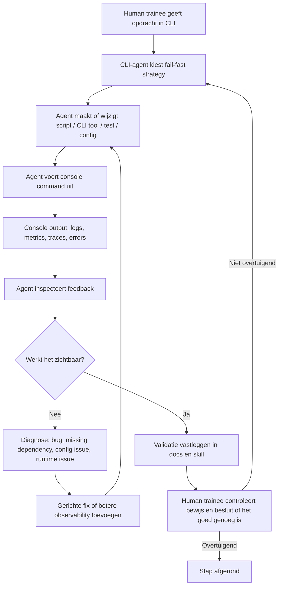

# Training: AI-assisted CLI Engineering — Build, Validate, Observe, Test Coverage en Controleren zonder zelf te programmeren

## Korte samenvatting

Dit is een **2-uurs hands-on training in een Teams call**. Iedereen werkt tegelijk aan dezelfde opdracht, meestal met een eigen lokale CLI-agent. Je zit dus samen in de call, voert prompts uit, kijkt wat de AI-agent doet, wacht soms tot de agent klaar is, en bespreekt tussendoor wat je ziet.

De belangrijkste regel:

> **Je programmeert niets zelf. Je gebruikt de CLI-agent om code, scripts, tests, documentatie, build-pipelines, launchers, clients, load tests en analyzers te maken. Jouw werk is sturen, controleren, valideren en bijsturen.**

De training draait om **true validation**: niet vertrouwen op mooie AI-uitleg, maar de CLI-agent laten bouwen, draaien, falen, loggen, meten, opnieuw proberen en bewijs produceren via console output, logs, metrics, traces, reports en documentatie.

Het IRC/ngircd voorbeeld is bewust een **out-of-comfort-zone voorbeeld**. Het is niet het kernleerdoel van de training. Dezelfde aanpak had ook toegepast kunnen worden op vrijwel elk GitHub source project: PyTorch, een frontend application, een backend service, een serverless project, een CLI tool, een mobile app, een data pipeline, een game engine, een library, of letterlijk bijna elke codebase waar build/run/test/observe mogelijk is.

---

## De centrale gedachte: de CLI-agent moet feedback loops bouwen

Een CLI-agent wordt pas echt nuttig als hij niet alleen code schrijft, maar ook een **observable feedback loop** maakt. Dat betekent dat hij iets uitvoerbaars maakt, het draait, output bekijkt, bugs vindt, code of scripts verbetert, opnieuw draait, en dit herhaalt totdat het resultaat zichtbaar werkt.

In deze training vraag je de CLI-agent dus steeds om iets te maken dat informatie teruggeeft:

- een `script`
- een `CLI tool`
- een `console application`
- een `smoke test`
- een `build command`
- een `GitHub Actions-style local CI simulation`
- een `launcher`
- een `IRC client`
- een `load test`
- een `analyzer`
- logs, metrics, traces en markdown reports

De agent gebruikt die output daarna weer als input om fouten te diagnosticeren en verbeteringen te maken.



### De repository is vervangbaar

In deze training gebruiken we `ngircd` en IRC als concreet voorbeeld omdat het een echte server, protocol, client, launcher, load test en analyzer mogelijk maakt. Maar dit is geen IRC-training.

Dezelfde loop geldt voor elk projecttype:

```text
GitHub source project → agent ontdekt build/run/test → agent maakt observability → agent valideert → agent documenteert → human controleert bewijs
```

Voorbeelden die even goed passen:

- PyTorch of een andere machine learning library
- frontend application, bijvoorbeeld React, Vue, Angular of Svelte
- backend service, bijvoorbeeld Node.js, Java, .NET, Go, Rust of Python
- serverless project, bijvoorbeeld AWS Lambda, Azure Functions of Cloudflare Workers
- mobile app
- CLI tool
- SDK of library
- data pipeline
- infrastructure-as-code repository
- game, simulation of embedded project

De kernvraag blijft steeds hetzelfde:

> Kan de CLI-agent een reproduceerbare feedback loop maken waarin build, run, test, logs, metrics, traces, reports en docs aantonen wat er werkt?

### Wat jij doet tijdens de loop

Jij bent niet de programmeur. Jij bent de **operator, reviewer en validator**.

Jouw taken:

1. Je geeft duidelijke opdrachten aan de CLI-agent.
2. Je kijkt of de agent eerst een snelle failure of smoke check doet.
3. Je controleert of de agent iets uitvoerbaars maakt.
4. Je controleert of de agent het ook echt draait.
5. Je leest console output, logs en reports.
6. Je stelt kritische vervolgvragen als output onduidelijk is.
7. Je laat de agent documentatie bijwerken.
8. Je laat de agent stoppen of bijsturen als hij blind blijft retryen.
9. Je valideert of het resultaat reproduceerbaar is.

### Wat je niet doet

Tijdens deze training doe je bewust niet zelf:

- Geen code met de hand schrijven.
- Geen scripts zelf fixen.
- Geen build files handmatig aanpassen.
- Geen test harness zelf maken.
- Geen analyzer zelf bouwen.
- Geen launcher zelf corrigeren.

Je mag wel:

- Commands lezen.
- Output interpreteren.
- De agent instrueren om iets anders te proberen.
- Eisen stellen aan validatie.
- Fouten aanwijzen op basis van bewijs.
- De agent vragen om uitleg over gemaakte keuzes.
- De agent vragen om documentatie te verbeteren.

---

## Trainingvorm: 2 uur samen in Teams

### Werkvorm

Iedereen zit in dezelfde Teams call en werkt tegelijk aan dezelfde opdracht. De trainer of facilitator bewaakt de tijd, bespreekt opvallende agent-gedragingen, en vraagt deelnemers om output of problemen te delen.

Er zijn momenten waarop je wacht op de AI-agent. Dat is normaal. Gebruik die wachttijd om:

- Console output te lezen.
- Te controleren of de agent zichtbaar werkt.
- `/docs/` te bekijken.
- Gegenereerde scripts te inspecteren.
- Te vergelijken met andere deelnemers.
- Te noteren waar de agent blind, slim, traag of creatief is.

### Belangrijk trainingsdoel

Het doel is niet dat iedereen exact dezelfde code krijgt. Het doel is dat iedereen leert om een CLI-agent te besturen met een **evidence-based workflow**:

```text
prompt → build/run → observe → diagnose → improve → validate → document
```

### Aanbevolen tijdschema voor 2 uur

| Tijd | Onderdeel | Doel |
|---:|---|---|
| 00:00–00:10 | Intro en mindset | Niet zelf programmeren; wel sturen en valideren |
| 00:10–00:20 | Workspace en repo setup | `AITraining/src/ngircd` klaarzetten |
| 00:20–00:35 | CLI-agent operating prompts | Execution-first loop en `/docs/` regels laden |
| 00:35–00:55 | Build en documentatie | Agent build laten ontdekken, uitvoeren en documenteren |
| 00:55–01:10 | Skill genereren | Agent maakt `SKILL.md` of `AGENTS.md` |
| 01:10–01:25 | Local CI/CD simulation | GitHub Actions-style pipeline lokaal laten werken |
| 01:25–01:40 | Launcher scripts | Bash/cmd.exe entry points laten maken |
| 01:40–01:50 | Out-of-comfort-zone feature en validation scenario | Agent maakt bijvoorbeeld IRC client + 30s load test, of een equivalent scenario voor een ander project |
| 01:50–01:57 | Coverage, trace gaps en usage controls | Agent genereert tests, kijkt naar uncovered/untraced paths en past tokenreductie toe |
| 01:57–02:00 | Wrap-up | Wat werkte, wat faalde, hoe valideerde je? |

Als een agent achterloopt, rond dan af met wat wél bewezen is. Een gedeeltelijk gevalideerde workflow is beter dan een grote claim zonder bewijs.

---

## Course Outcomes

Na deze training kun je:

1. Een CLI-agent aansturen zonder zelf te programmeren.
2. Een agent dwingen om een execution-first workflow te gebruiken.
3. Controleren of een agent echte validatie doet.
4. Console output, logs, metrics en traces gebruiken als bewijs.
5. Een bestaande repository laten builden door een agent.
6. Projectdocumentatie laten onderhouden in `/docs/`.
7. Een project-specifieke `SKILL.md` of `AGENTS.md` laten genereren.
8. Een lokale GitHub Actions-style CI/CD simulation laten maken en draaien.
9. Launcher scripts laten maken voor bash en cmd.exe.
10. Een out-of-comfort-zone feature laten bouwen op basis van externe specificaties, waarbij IRC/RFC 1459 slechts één voorbeeld is.
11. Een 30-seconden load test of vergelijkbare stress/validation scenario laten uitvoeren.
12. Unit tests laten genereren en uitbreiden richting 100% code coverage, inclusief happy flow tests voor nog niet getraceerde code paths.
13. Een analyzer laten maken voor underutilization, waiting patterns en bottlenecks.
14. Tokenreductie technieken en usage controls toepassen tijdens lange agent-runs.
15. Het verschil herkennen tussen AI-output en gevalideerde AI-output.

---

# Voorbereiding

## Benodigdheden

- Teams call met alle deelnemers.
- Lokale terminal.
- Git.
- Een CLI coding agent, bijvoorbeeld Copilot CLI of vergelijkbaar.
- Internettoegang om `ngircd` te clonen.
- Een shell:
  - bash op Linux/macOS/WSL, of
  - `cmd.exe` op Windows.
- Genoeg rechten om lokaal build tools te gebruiken.

## Belangrijke afspraak

Als jouw machine bepaalde dependencies mist, is dat onderdeel van de training. Laat de agent dit detecteren, uitleggen en documenteren. Installeer niet blind zelf allerlei tooling zonder dat de agent uitlegt waarom.

---

# Module 1 — Workspace setup en repository voorbereiding

## Doel

Maak een lokale training workspace en bereid een bestaande open-source repository voor op AI-assisted engineering.

## Opdracht

Maak een `AITraining` folder. Je mag daar optioneel een Git repository van maken. Maak daarin een `src` folder en clone `ngircd`.

## Commands

```bash
mkdir AITraining
cd AITraining

# Optioneel: track je training artifacts
git init

mkdir src
cd src
git clone https://github.com/ngircd/ngircd
cd ngircd

# Verwijder upstream Git history uit de cloned folder
rm -rf .git
```

## Windows cmd.exe equivalent

```bat
mkdir AITraining
cd AITraining

git init

mkdir src
cd src
git clone https://github.com/ngircd/ngircd
cd ngircd

rmdir /s /q .git
```

## Validatie

Laat de CLI-agent of jezelf dit controleren:

```bash
pwd
ls -la
test ! -d .git && echo "Repository detached successfully"
```

Verwachte output:

```text
Repository detached successfully
```

## Deliverables

- `AITraining/`
- `AITraining/src/ngircd/`
- Geen `.git` folder meer in `ngircd`.

---

# Module 2 — CLI-agent instellen op execution-first werken

## Doel

Zorg dat de CLI-agent altijd probeert om iets uitvoerbaars te maken, het te runnen, output te inspecteren en te itereren.

## CLI setup voorbeeld

Afhankelijk van je CLI-agent kun je iets hebben zoals:

```text
/login
/model
Claude Haiku
/yolo
```

Gebruik de equivalenten voor jouw omgeving.

## Prompt: execution-first operating mode

Plak dit in de CLI-agent:

```text
You are an autonomous coding agent in this CLI: for every assignment, prefer an execution-first workflow where you create or modify a runnable script, CLI tool, console application, test harness, or executable validation path; run it from the console; inspect the output as the main feedback signal; and iterate through implement → run → observe → diagnose → improve → run again until the requested outcome is achieved.

Start by finding the quickest meaningful way to fail fast, such as a minimal reproduction, smoke test, dry run, targeted unit test, type check, lint check, or smallest executable validation command, so failures surface early and can drive faster improvement.

Do not stop after only writing code: make the work observable, testable, and diagnosable by adding clear console messages, structured logging, error reporting, progress output, tracing, metrics, diagnostics, integration tests, or end-to-end validation wherever the solution lacks feedback.

Treat failures and unclear output as inputs for the next iteration, not as stopping points. Continue working until the assignment is implemented, validated, and visibly satisfies the request.

Stop early only when blocked by missing information, missing access, unsafe instructions, or a hard technical limitation; when that happens, explicitly state:

“I am stopping early because: <reason>. To continue effectively, I need: <specific instruction, missing context, permission, or constraint>.”

Always provide visible feedback inside the CLI while working so I understand what is happening; no black-box execution is allowed, and nothing should run silently for an extended period without progress messages, status updates, logs, or other observable output.
```

## Validatievraag aan de agent

Vraag daarna:

```text
Summarize your current operating rules for this repository in five bullets.
```

De agent moet noemen:

- execution-first
- fail-fast
- console output
- iterative improvement
- stoppen met expliciete reden als hij geblokkeerd is

---

# Module 3 — Documentatie continu laten bijwerken in `/docs/`

## Doel

De CLI-agent moet tijdens het werk een audit trail opbouwen. Dit voorkomt dat kennis alleen in chatgeschiedenis of console scrollback zit.

## Prompt: `/docs/` als audit en knowledge tracking folder

Plak dit in de CLI-agent:

```text
Continuously maintain project documentation in the `/docs/` folder of the current working directory while working in this CLI. Treat `/docs/` as the audit and knowledge-tracking area for everything discovered during planning, building, debugging, testing, and code analysis.

Create the folder if it does not exist, then write and keep updating clear markdown files that capture planning decisions, functional flows, technical components, applications, units/modules, architecture overviews, runtime behavior, build/run/test workflows, configuration assumptions, dependencies, integration points, risks, known issues, and important implementation insights.

Organize the documentation into logical markdown files by unit, component, application, or domain, for example `/docs/overview.md`, `/docs/planning.md`, `/docs/functional-flows.md`, `/docs/technical-components.md`, `/docs/build-and-run.md`, and component-specific files under `/docs/components/` or `/docs/applications/` when useful.

Do not let documentation become stale: whenever you discover a new high-level insight, architectural relationship, functional flow, technical dependency, important command, failure mode, or implementation decision, update the relevant markdown file immediately or before finishing the current iteration.

Prefer concise, evidence-based notes from the actual repository and console output over speculation. Include exact commands, file paths, discovered responsibilities, component boundaries, data/control flows, assumptions, open questions, and validation status where useful.

Keep the docs readable for a future CLI agent or developer who needs to understand the project quickly without rediscovering everything from scratch.

If existing docs are present, preserve useful content and update or extend it rather than replacing it blindly.

Before considering the assignment complete, review `/docs/` and ensure it contains an accurate, current, markdown-based audit trail of the planning, discovered functional flows, technical components, high-level descriptions, and application/unit/component knowledge gathered during the work.
```

## Verwachte docs

```text
docs/
├── overview.md
├── planning.md
├── functional-flows.md
├── technical-components.md
├── build-and-run.md
├── validation.md
├── troubleshooting.md
├── ci-cd-simulation.md
├── launcher-workflow.md
├── irc-client.md
├── load-testing.md
└── performance-analysis.md
```

## Validatie

```bash
find docs -type f -name "*.md" -maxdepth 3 -print
```

Controleer niet alleen of de files bestaan, maar ook of ze echte commands, observed output en decisions bevatten.

---

# Module 4 — Recursive build laten uitvoeren

## Doel

Laat de CLI-agent de build system(en) detecteren, snel falen waar mogelijk, daarna bouwen, testen en documenteren.

## Prompt: build everything recursively

Plak dit in de CLI-agent:

```text
Build everything recursively in the current working directory using any practical solution necessary, with the goal of getting a working build in the quickest reliable way possible within roughly 5–10 minutes.

First detect the available build systems, package managers, language runtimes, lockfiles, workspace files, and platform constraints, then choose the fastest build strategy that is compatible with this machine and project structure.

Prefer parallel and incremental builds where safe, reuse caches, avoid unnecessary clean builds, and respect project-specific configuration.

Traverse subprojects recursively, but skip irrelevant directories such as dependency folders, build outputs, caches, virtual environments, temporary folders, and generated artifacts unless the project explicitly requires them.

Find the quickest meaningful way to fail fast before doing expensive work, such as a smoke build, dry run, targeted build, dependency check, type check, or minimal reproducible build command.

For each build target, run the correct command, show clear console feedback, diagnose failures, and apply focused fixes that move the build toward completion.

You may use any reasonable workaround, patch, script, build flag, dependency install, configuration adjustment, or reduced build path if it helps achieve a working build faster without hiding real failures.

Avoid endless loops, repeated blind retries, or low-value changes that do not improve the result.

If a full recursive build cannot be completed quickly, produce the best working build path available, clearly identify what succeeded, what remains blocked, and the exact next command or fix needed.

Do not stop after discovery; execute the build, observe the results, improve based on evidence, and continue only while each iteration meaningfully increases the chance of a working end result.
```

## Waar jij op let

Controleer of de agent:

- build systems detecteert
- dependency checks uitvoert
- eerst een snelle smoke check probeert
- commands zichtbaar print
- failures uitlegt
- niet blind blijft retryen
- `/docs/build-and-run.md` bijwerkt

## Mogelijke build commands voor `ngircd`

De agent moet dit zelf ontdekken, maar typische commands kunnen zijn:

```bash
./autogen.sh
./configure
make -j"$(nproc)"
make check
```

macOS variant:

```bash
make -j"$(sysctl -n hw.ncpu)"
```

## Validatie

Een mogelijke smoke check:

```bash
./src/ngircd/ngircd --version
```

De exacte binary path moet door de agent uit de build output worden afgeleid.

---

# Module 5 — Project skill genereren

## Doel

Laat de CLI-agent de repository analyseren en een herbruikbare `SKILL.md` of `AGENTS.md` maken.

## Prompt: generate project skill

Plak dit in de CLI-agent:

```text
Analyze the current working directory and everything that was just built using the native Copilot CLI way of working: inspect the repository structure, source code, build outputs, scripts, configuration files, tests, logs, generated artifacts, and console output to discover the repeatable workflow for this project, including how to build, run, test, debug, observe, validate, and recover from common failures.

Use evidence from the actual repo instead of guesses.

Start with the quickest meaningful fail-fast checks such as smoke builds, dry runs, targeted tests, dependency checks, or minimal validation commands, and iterate only while each step improves the result or produces useful knowledge, avoiding endless loops or blind retries.

Create a reusable markdown-based skill, such as SKILL.md or AGENTS.md, that any compatible CLI coding agent can use later without rediscovering the project from scratch, capturing exact build/run/test commands, expected outputs where useful, important directories, generated files, dependency and environment assumptions, logging and observability expectations, integration-test strategy, known pitfalls, troubleshooting steps, fallback paths, decision rules, and completion criteria.

Keep the skill execution-oriented rather than descriptive, include helper scripts or reference files only if they materially improve repeatability, and prioritize the information another agent needs to successfully build, run, test, and debug this codebase within 5–10 minutes.

While working, always provide visible CLI feedback through progress messages, status updates, logs, or observable output so nothing runs as a black box or stays silent for a long time.

Continue until the generated skill is useful, validated against the current project, and clearly explains how another agent should work with this codebase.

Stop early only when blocked by missing information, missing access, unsafe instructions, or a hard technical limitation, and if that happens say:

“I am stopping early because: <reason>. To continue effectively, I need: <specific instruction, missing context, permission, or constraint>.”
```

## Validatie

Vraag daarna:

```text
Read the SKILL.md or AGENTS.md you generated. Summarize the exact build, run, test, and troubleshooting workflow it defines. Then verify that the commands still match the current repository.
```

---

# Module 6 — Generated skill lezen en gebruiken

## Doel

De skill mag geen statische tekst zijn die niemand gebruikt. De agent moet hem lezen en als operating guide toepassen.

## Prompt

```text
Read the SKILL.md, AGENTS.md, or equivalent agent instruction file that was generated for this repository. Use it as the primary operating guide for all further work. Validate that it accurately reflects the current project structure, build commands, run commands, tests, generated artifacts, and troubleshooting paths. If any section is stale, incomplete, ambiguous, or not execution-oriented enough, update it now and document the change in `/docs/`.
```

## Validatie

Laat de agent één command uit de skill exact uitvoeren. Als dat command faalt, moet de agent de skill bijwerken.

---

# Module 7 — Nieuwe skills laten maken met een general GenAI chat window

## Doel

Gebruik een algemene GenAI chat window om skill prompts te genereren. Daarna geef je die lokale skill files aan de CLI-agent.

## Prompt: skills over de AI-agent zelf

```text
Create reusable markdown skills that describe how an AI coding assistant should work on this project. Generate multiple named skill files, each focused on a distinct capability.

Use the following naming pattern:
- SKILL-repository-build.md
- SKILL-project-documentation.md
- SKILL-launchers.md
- SKILL-irc-client.md
- SKILL-load-testing.md
- SKILL-performance-analysis.md

Each skill must include:
- Purpose
- When to use it
- Required inputs
- Execution-first workflow
- Exact commands or command templates
- Validation steps
- Observable console feedback requirements
- Failure handling rules
- Documentation updates required in `/docs/`
- Completion criteria

Make the skills practical for a CLI coding agent, not theoretical. Each skill should help the agent build, run, test, debug, or analyze the project without rediscovering basic workflow.
```

## Prompt: skill uit bestaande projectinformatie

```text
Inspect this project and generate a project-specific SKILL.md for a CLI coding agent.

The skill must be based on evidence from the repository, including:
- Directory structure
- Build files
- Scripts
- Test commands
- Runtime configuration
- Generated artifacts
- Existing documentation
- Recent commit history if available
- Common failure patterns from attempted commands

The generated skill must tell a future agent how to:
- Build the project quickly
- Run the project locally
- Test the project
- Debug startup failures
- Observe logs and metrics
- Update documentation
- Know when the task is complete

Save the result as `SKILL-<project-name>.md`.
```

## Prompt: CLI lokale skills laten lezen

```text
Read all local files matching `SKILL*.md` and `AGENTS.md` in the current working directory and subdirectories. Treat them as operating instructions for this project.

Summarize:
- Which skill files were found
- What each one is for
- Which commands they define
- Which validation steps they require
- Any contradictions or stale instructions

Then update `/docs/skills-index.md` with a concise index of the available skills and how future agents should use them.
```

---

# Module 8 — Local GitHub Actions-style CI/CD simulation

## Doel

Laat de CLI-agent een lokale CI/CD simulation maken die zich gedraagt als een vereenvoudigde GitHub Actions runner. Dit is logisch na de eerste build en skill-generation, omdat de agent dan genoeg weet over de repository om build, test, package en delivery te automatiseren.

De simulation moet lokaal in bash of `cmd.exe` draaien en console output tonen in GitHub Actions-style.

## Waarom deze stap belangrijk is

Een echte CI/CD pipeline is een sterke vorm van validatie. Je vraagt de agent niet alleen om een project lokaal te builden, maar ook om een reproduceerbare pipeline te maken die:

- dependency checks doet
- build commands uitvoert
- tests of smoke checks draait
- artifacts maakt
- delivery naar een lokale folder doet
- logs en reports produceert
- faalt met duidelijke diagnostics

## Prompt: local GitHub Actions-style CI/CD simulation

```text
Create and run a local GitHub Actions-style CI/CD simulation for this project.

The goal is to make a repeatable local console application that behaves like a simplified GitHub Actions runner for this repository. It must run from bash, and when practical also from Windows cmd.exe.

Create or update scripts such as:
- `scripts/simulate-github-actions-ci.sh`
- `scripts/simulate-github-actions-ci.bat`

Also create a documentation file:
- `docs/ci-cd-simulation.md`

If useful, create a reference workflow file:
- `.github/workflows/local-ci-simulation.yml`

The simulation must:
- Detect the repository root and project layout.
- Detect the build system and explain the selected strategy.
- Check required tools and dependencies.
- Run the fastest meaningful build path for this project.
- Run smoke tests or available tests.
- Package or stage useful build outputs.
- Deliver artifacts into a local delivery folder under the current project, preferably `src/delivery/` unless that conflicts with the repository structure.
- Create logs, reports, and an artifact manifest.
- Print GitHub Actions-style grouped console output using markers such as `::group::`, `::endgroup::`, `::notice`, `::warning`, and `::error` where appropriate.
- Clearly show every major step, command, result, artifact path, and final status.
- Fail fast with useful diagnostics when a required tool, build step, test step, or delivery step fails.
- Avoid silent long-running commands; print progress before and after each major command.
- Be safe to rerun by creating or refreshing generated output folders without deleting source files.
- Update `/docs/ci-cd-simulation.md` with exact commands, generated files, validation status, known limitations, and troubleshooting steps.

Run the local CI/CD simulation from the console. Inspect the output and generated delivery folder. Fix issues and rerun until the simulated build and delivery pipeline works in the local GitHub Actions-style sense.

Completion criteria:
- The bash CI simulation runs successfully in this environment, or explains the exact platform limitation.
- The cmd.exe variant exists or the limitation is documented.
- The script produces GitHub Actions-style grouped console output.
- The project is built or the best available build path is executed.
- Tests or smoke checks are run.
- Artifacts are delivered into the selected local delivery folder.
- Logs, reports, and a manifest are generated.
- `/docs/ci-cd-simulation.md` accurately explains how to run, interpret, and troubleshoot the pipeline.
```

## Voorbeeld console output

```text
::group::CI Simulation: checkout
[ci] Repository root: /path/to/AITraining/src/ngircd
[ci] Commit: local-working-tree
[ci] Branch: local
::endgroup::

::group::CI Simulation: detect build system
[ci] Found configure.ac
[ci] Found autogen.sh
[ci] Selected build strategy: autotools
::endgroup::

::group::CI Simulation: dependencies
[ci] Checking required tools: sh, make, cc, pkg-config, autoconf, automake
[ci] OK: make found
[ci] OK: cc found
::endgroup::

::group::CI Simulation: build
[ci] Running: ./autogen.sh
[ci] Running: ./configure
[ci] Running: make -j4
::endgroup::

::group::CI Simulation: test
[ci] Running: make check
[ci] Smoke test: ./src/ngircd/ngircd --version
::endgroup::

::group::CI Simulation: deliver
[ci] Delivering artifacts to: src/delivery/artifacts
[ci] Delivery complete
::endgroup::

::notice title=CI Simulation Complete::Build, test, package, and delivery completed successfully.
```

## Deliverables

- `scripts/simulate-github-actions-ci.sh`
- `scripts/simulate-github-actions-ci.bat`, waar praktisch
- `.github/workflows/local-ci-simulation.yml`, indien nuttig
- `src/delivery/` of `delivery/`
- artifact manifest
- logs en reports
- `docs/ci-cd-simulation.md`

## Validatie

```bash
chmod +x scripts/simulate-github-actions-ci.sh
scripts/simulate-github-actions-ci.sh
```

Controleer daarna:

```bash
find src/delivery delivery -maxdepth 4 -type f 2>/dev/null
cat src/delivery/artifacts/manifest.json 2>/dev/null || cat delivery/artifacts/manifest.json
```

Waar jij op let:

- Staat er `::group::` output?
- Zijn commands zichtbaar?
- Is er een delivery folder?
- Is er een manifest?
- Zijn logs en reports aanwezig?
- Is de failure mode duidelijk als iets faalt?

---

# Module 9 — Launcher scripts voor local OS entry points

## Doel

Laat de software starten via lokale entry points: bash op Linux/macOS en waar praktisch `cmd.exe` op Windows.

## Prompt: launcher scripts

```text
Create or update operating-system-appropriate launcher scripts for this software so it is completely runnable from my local OS entry point, including cmd.exe on Windows and bash on Linux/macOS whenever practical.

Provide or update a .bat script for cmd.exe and a .sh script for bash with equivalent behavior, sensible default generated configuration, clear console feedback, and safe defaults so the software can run without manual setup first.

Do not assume the build/runtime environment is the same as my local OS: first detect how the software was built and what environment it depends on, such as Windows, Linux, WSL, Docker, a VM, emulator, simulator, container, language runtime, SDK, or specific shell, then make the local launcher enter or invoke that required environment automatically from my local cmd.exe or bash entry point.

If execution scripts already exist, update them instead of duplicating them, especially if they were created earlier, so the final scripts all follow this local-entry-point workflow.

The launcher must detect missing prerequisites, create required folders and config files, set safe defaults, explain what environment it is entering, run the correct command inside that environment, and show visible progress for every major step.

Test the launcher yourself from the console in the current environment, fix issues found, and keep iterating until at least one local launcher works reliably here.

When possible, validate both cmd.exe and bash variants, or clearly state which one could not be executed in this environment and why.

If networking is involved, make sure the software binds to an address and port reachable from my local OS environment, not only from inside a container, VM, WSL instance, or simulator.

Print the final local URL or connection command, verify it with a simple connectivity check where possible, and document any required port forwarding, host mapping, firewall note, or environment bridge.

After it works, explain exactly how I should use it from my local OS, including the command to run from cmd.exe and/or bash, where the generated configuration is located, how to edit it, how to stop the software, how to access any network service locally, and how to troubleshoot common startup or connectivity problems.

The final result must be practical and tested, not theoretical: include runnable scripts, updated existing scripts where applicable, verified commands, visible console output, and a clear explanation of how I can run and use the software from my local cmd.exe or bash while the launcher handles entering whatever build/runtime environment the software actually requires.
```

## Verwachte script names

```text
run-ngircd.sh
run-ngircd.bat
```

## Validatie

```bash
chmod +x ./run-ngircd.sh
./run-ngircd.sh
```

In een tweede terminal:

```bash
nc -vz 127.0.0.1 6667
```

---

# Module 10 — Out-of-comfort-zone feature bouwen, met IRC als voorbeeld

## Doel

Laat de CLI-agent een feature bouwen die buiten je dagelijkse comfort zone ligt, op basis van echte projectinformatie en externe specificaties. In dit cursusdocument is IRC het voorbeeld, maar de onderliggende oefening is generiek.

Voor een frontend project kan dit bijvoorbeeld een browser-based smoke test zijn. Voor een backend project kan dit een API client of integration test zijn. Voor een serverless project kan dit een local invocation harness zijn. Voor een library kan dit een executable example of conformance test zijn.

In het IRC voorbeeld bouwt de CLI-agent een functionele IRC client die kan verbinden met de lokaal draaiende `ngircd` server.

RFC 1459 is de functionele referentie voor IRC. De client hoeft niet alles te implementeren, maar moet genoeg kunnen om te registreren, een channel te joinen, berichten te sturen, `PING`/`PONG` te doen en netjes af te sluiten.

## Minimum functional requirements

De IRC client moet ondersteunen:

- TCP connection naar host en port
- optioneel `PASS`
- `NICK`
- `USER`
- `PING` handling met `PONG`
- `JOIN`
- channel `PRIVMSG`
- direct `PRIVMSG`
- `PART`
- `QUIT`
- duidelijke sent/received logs
- timeout handling
- error reporting
- command-line arguments

## Generieke prompt: out-of-comfort-zone validation feature

Gebruik deze prompt als je niet met IRC werkt:

```text
Build an out-of-comfort-zone validation feature for this repository.

First inspect the project type, available runtime, existing scripts, tests, documentation, and build outputs. Then choose a practical feature or validation harness that proves the project can be exercised beyond a trivial build.

Examples:
- For a frontend application: create a local browser or headless smoke test that loads the app and validates a key user flow.
- For a backend service: create a CLI/API client that calls core endpoints and validates responses.
- For a serverless project: create a local invocation harness with representative events.
- For a library: create executable examples and conformance-style tests.
- For a protocol/server project: create a client or integration test based on the relevant protocol specification.

Do not only write code. Create a runnable script, console app, or test harness, run it, inspect the output, fix failures, and document the validated workflow.

Update `/docs/` and the relevant skill file with exact commands, observed output, limitations, and troubleshooting notes.
```

## Voorbeeldprompt: IRC client

```text
Build a functional IRC client using RFC 1459 as the protocol reference and connect it to the local ngircd server.

The client must be runnable from the console and must implement at least:
- TCP connect
- PASS when configured
- NICK
- USER
- PING/PONG
- JOIN
- PRIVMSG to channel
- PRIVMSG to user
- PART
- QUIT
- readable sent/received logs
- timeout and connection error handling

Create the quickest practical implementation in a language/runtime available in this repository environment. Add command-line arguments for host, port, nick, user, real name, channel, message, and timeout.

Run it against the local server. Iterate until it connects, registers, joins a channel, sends a test message, handles PING/PONG if observed, and exits cleanly.

Update `/docs/irc-client.md` and the relevant skill file with exact commands, observed output, limitations, and troubleshooting notes.
```

## Validatievoorbeeld

```bash
./irc-client --host 127.0.0.1 --port 6667 --nick aitest --user aitest --channel '#aitest' --message 'hello from AITraining'
```

---

# Module 11 — 30-seconden load test of validation stress scenario

## Doel

Laat de CLI-agent een load test of vergelijkbaar stress/validation scenario maken. Voor IRC betekent dit meerdere clients die ongeveer 30 seconden lang verschillende IRC messages naar de server sturen. Voor andere projecttypes kan dit bijvoorbeeld API traffic, UI flow repetition, batch jobs, queue events, serverless invocations of library calls zijn.

## Requirements

De load test moet:

- standaard 30 seconden draaien
- meerdere concurrent clients gebruiken waar praktisch
- gevarieerde IRC actions sturen
- uitgebreide logs opslaan
- structured metrics opslaan
- traces of event timelines opslaan
- progress output tonen
- clean shutdown doen
- een summary printen

## Prompt: load test

```text
Create a 30-second load test for the IRC client and local ngircd server.

The load test must run from the console and create observable output while running. It should start multiple client sessions, send a varied mix of IRC protocol messages, and collect logs, metrics, and traces.

Requirements:
- Default duration: 30 seconds
- Configurable host, port, channel, client count, message rate, and output directory
- Visible progress output at least every few seconds
- Per-client logs
- Structured metrics file, preferably JSON or CSV
- Trace/event timeline file with timestamps for connect, register, join, send, receive, error, reconnect, and quit events
- Final summary with total attempts, successful connects, failed connects, messages sent, messages received, errors, latency estimates if available, and throughput
- Safe shutdown and cleanup

Run the load test against the local server, inspect the output, fix issues, and update `/docs/load-testing.md` with exact commands, output paths, observed results, and known limits.
```

## Voorbeeld command

```bash
./irc-load-test --host 127.0.0.1 --port 6667 --channel '#loadtest' --clients 20 --duration 30 --rate 5 --out logs/load-test
```

---

# Module 12 — Logging, metrics en traces verbeteren

## Doel

Laat de load test genoeg informatie produceren om bottlenecks te kunnen analyseren.

## Verwachte output folder

```text
logs/load-test/<timestamp>/
├── summary.json
├── metrics.csv
├── traces.jsonl
├── errors.log
├── clients/
│   ├── client-001.log
│   ├── client-002.log
│   └── ...
└── README.md
```

## Prompt: observability verbeteren

```text
Improve the IRC load test so it saves substantial logging, metrics, and traces that are useful for analysis.

Add or verify:
- Per-client logs
- A structured summary JSON
- A metrics CSV sampled during the run
- A JSONL trace file with timestamped events
- Error logs
- A README in the output folder explaining the files
- Progress output during execution
- Final summary output

Run the load test again for 30 seconds, inspect the generated artifacts, and update `/docs/load-testing.md` and `/docs/performance-analysis.md` with exact artifact paths, schemas, and observed results.
```

## Validatie

```bash
ls -R logs/load-test
head -n 5 logs/load-test/*/traces.jsonl
head -n 5 logs/load-test/*/metrics.csv
cat logs/load-test/*/summary.json
```

---

# Module 13 — Unit tests genereren, coverage verhogen en untraced paths vinden

## Doel

Laat de CLI-agent test coverage systematisch verbeteren. Het doel is niet dat jij unit tests schrijft, maar dat de agent op basis van coverage output, trace logs en runtime observability ontdekt welke code paths nog onvoldoende gevalideerd zijn.

De ambitie aan het einde is **100% code coverage waar praktisch haalbaar**, of anders een duidelijk, evidence-based verslag waarom 100% niet haalbaar of niet zinvol is voor bepaalde files, generated code, platform-specific branches of unreachable defensive code.

## Belangrijk principe

Coverage is geen doel op zichzelf. De agent moet vooral zoeken naar:

- code paths zonder test coverage
- code paths zonder trace/log bewijs
- happy flow paths die nog niet door unit tests worden geraakt
- branches die alleen via error handling geraakt worden
- integration paths die beter via smoke/integration tests dan unit tests gevalideerd worden
- dead code of unreachable code
- generated files die uitgesloten moeten worden

## Prompt: coverage en trace gaps

```text
Generate and improve unit tests for this repository until code coverage is as close to 100% as practical, preferably 100% for the code created during this training.

Do not hand-wave coverage. First detect the language, test framework, coverage tooling, existing tests, and current coverage command. If no coverage tooling exists, add the smallest practical coverage setup for this environment.

Run the current tests with coverage and inspect the uncovered files, uncovered lines, uncovered branches, and missing paths.

Also inspect trace logs, runtime logs, and validation output from the launchers, CI simulation, client, load test, and analyzer. Identify code paths that do not show evidence in trace logs or console output. For those paths, add happy flow unit tests where appropriate.

Workflow:
1. Run the smallest meaningful test or coverage command.
2. Save coverage output to a report file.
3. Identify uncovered or untraced happy flow paths.
4. Add focused unit tests for those paths.
5. Rerun coverage.
6. Repeat only while each iteration clearly improves coverage or validation quality.
7. Avoid brittle tests that only assert implementation details.
8. Prefer deterministic tests with clear assertions.
9. Document exclusions and limitations honestly.
10. Update `/docs/validation.md`, `/docs/testing-and-coverage.md`, and the relevant skill file.

Completion criteria:
- Unit tests exist for the training-created code.
- Coverage command is documented.
- Coverage report is generated.
- Uncovered paths are listed.
- Untraced paths are listed.
- Happy flow tests are added for practical untraced paths.
- Coverage reaches 100% where practical, or the remaining gap is explicitly justified.
```

## Verwachte artifacts

```text
docs/testing-and-coverage.md
reports/coverage/
reports/coverage/summary.txt
reports/coverage/coverage.json
reports/coverage/html/
```

Exacte namen hangen af van language/runtime.

## Waar jij op let

Controleer of de agent:

- coverage echt draait
- coverage output leest
- niet alleen test files schrijft
- uncovered lines noemt
- trace/log gaps koppelt aan tests
- 100% coverage niet claimt zonder report
- exclusions uitlegt
- docs bijwerkt

## Voorbeeld bijstuurprompt

```text
You added tests, but I do not see a coverage report. Run the coverage command, show the uncovered lines or confirm 100% coverage from the actual report, then update `/docs/testing-and-coverage.md`.
```

---

# Module 14 — Analyzer bouwen voor bottlenecks en waiting patterns

## Doel

Laat de CLI-agent een analyzer maken of gebruiken die de load-test artifacts leest en een report maakt.

## Analyzer moet vinden

- underutilization
- waiting patterns
- bottlenecks
- error clusters
- slow connect/register/join phases
- send/receive imbalance
- client starvation
- idle periods
- throughput over time
- resource of server-side limits uit logs

## Prompt: analyzer

```text
Analyze the IRC load-test logs, metrics, and traces. Build an analyzer if needed.

The analyzer must read the generated load-test output directory and identify:
- Underutilization
- Waiting patterns
- Bottlenecks
- Error clusters
- Slow connect/register/join phases
- Send/receive imbalance
- Client starvation or idle periods
- Throughput over time
- Resource or server-side limits visible from logs

Create a runnable analyzer script or CLI tool. It should accept an output directory path and generate a markdown report plus a structured JSON summary.

Run the analyzer on the latest load-test output. Inspect the report, improve the analyzer if the report is vague or missing useful signals, and update `/docs/performance-analysis.md` with exact commands, findings, limitations, and recommended follow-up tests.
```

## Voorbeeld command

```bash
./analyze-load-test --input logs/load-test/latest --out reports/load-analysis.md
```

## Verwachte report sections

```text
# IRC Load Test Analysis

## Executive Summary
## Test Configuration
## Throughput Over Time
## Client Lifecycle Timing
## Latency Statistics
## Errors and Failure Groups
## Waiting and Idle Patterns
## Underutilization Signals
## Bottleneck Hypotheses
## Evidence
## Recommended Next Experiments
## Appendix: Files Analyzed
```

---

# Module 15 — Tokenreductie technieken en usage controls tijdens lange agent-runs

## Doel

Lange CLI-agent runs kunnen veel tokens, context en tijd gebruiken. In deze module leer je de agent te laten werken met usage controls: gerichte context, compacte summaries, artifact-based handoff en duidelijke stopcriteria.

Het doel is niet om de agent minder goed te laten werken, maar om verspilling te voorkomen en controle te houden.

## Waarom dit belangrijk is

Een agent kan snel veel context vullen met:

- lange build logs
- repeated failures
- grote file dumps
- volledige test output
- onnodige directory listings
- lange chat summaries
- speculatieve analyses
- steeds opnieuw dezelfde uitleg

Goede tokenreductie betekent:

```text
meer bewijs, minder ruis
meer artifact references, minder copy-paste
meer summaries, minder volledige logs
meer targeted commands, minder brede scans
```

## Usage controls voor deelnemers

Gebruik deze controls tijdens de training:

1. Vraag de agent om korte progress updates.
2. Vraag om alleen relevante log excerpts te tonen.
3. Laat volledige logs naar files schrijven.
4. Laat summaries in `/docs/` of `reports/` zetten.
5. Vraag om `head`, `tail`, `grep`, targeted test commands en filtered traces.
6. Vraag om geen grote files volledig te printen.
7. Laat de agent een `current-state.md` bijwerken voor handoff.
8. Laat de agent stopcriteria noemen voordat hij lange loops start.
9. Laat de agent iedere retry motiveren.
10. Gebruik context compaction als de CLI dit ondersteunt.

## Prompt: tokenreductie en usage controls

```text
Apply token reduction and usage controls for the rest of this agent run.

Do not dump large files, full logs, full build output, or repeated directory listings into the chat unless explicitly needed. Write verbose output to files under `logs/`, `reports/`, or `/docs/`, then show concise excerpts and exact file paths.

Before long-running work, state:
- the goal
- the command or script that will run
- expected output artifact paths
- stop criteria
- what will be summarized instead of pasted fully

During debugging:
- use targeted commands such as `tail`, `head`, `grep`, focused test selection, filtered traces, and summarized coverage output
- avoid repeating the same failed command unless a specific change was made
- summarize repeated errors once and link them to artifact paths
- keep `/docs/current-state.md` updated with current status, blockers, next commands, and validation evidence

When context becomes large, create or update:
- `/docs/current-state.md`
- `/docs/decision-log.md`
- `/docs/open-issues.md`
- `/docs/validation.md`

If this CLI supports compaction, prepare a compact handoff summary before using it.

Completion criteria:
- Important evidence is stored in files.
- Chat/console output remains concise but sufficient.
- Repeated failures are summarized, not spammed.
- Current state is recoverable from `/docs/current-state.md`.
- Usage stays controlled without losing validation quality.
```

## Prompt: compact handoff summary

Gebruik deze prompt vlak voor `/compact` of een nieuwe agent-run:

```text
Prepare a compact handoff summary for the next CLI agent context.

Write `/docs/current-state.md` with:
- repository root
- current goal
- completed steps
- exact commands that succeeded
- exact commands that failed
- latest build status
- latest test status
- latest coverage status
- latest launcher status
- latest CI simulation status
- latest load-test status
- latest analyzer status
- generated artifact paths
- open issues
- next recommended command
- files that matter most

Then print only a short summary and the path to `/docs/current-state.md`.
```

## Tekenen van slecht usage control

Stuur bij als de agent:

- volledige logs blijft plakken
- steeds `find .` of `ls -R` over de hele repository doet
- dezelfde error meerdere keren volledig herhaalt
- lang blijft runnen zonder progress output
- geen artifact paths geeft
- geen stopcriteria noemt
- claims maakt zonder files of command output

## Bijstuurprompt

```text
Reduce output volume. Save full details to files, show only relevant excerpts, and update `/docs/current-state.md` with the current status and next command.
```

---


# Capstone — Wat moet er aan het einde liggen?

## Scenario

Je hebt een toekomstige CLI-agent voorbereid om de `AITraining/src/ngircd` omgeving te begrijpen, builden, starten, testen, load testen en analyseren zonder alles opnieuw te ontdekken.

## Verwachte structuur

Exacte namen mogen afwijken, maar de functies moeten aanwezig zijn:

```text
AITraining/
├── src/
│   └── ngircd/
│       ├── docs/
│       │   ├── overview.md
│       │   ├── build-and-run.md
│       │   ├── ci-cd-simulation.md
│       │   ├── launcher-workflow.md
│       │   ├── irc-client.md
│       │   ├── load-testing.md
│       │   ├── testing-and-coverage.md
│       │   ├── performance-analysis.md
│       │   ├── skills-index.md
│       │   └── current-state.md
│       ├── SKILL.md
│       ├── .github/
│       │   └── workflows/
│       │       └── local-ci-simulation.yml
│       ├── scripts/
│       │   ├── simulate-github-actions-ci.sh
│       │   └── simulate-github-actions-ci.bat
│       ├── run-ngircd.sh
│       ├── run-ngircd.bat
│       ├── irc-client
│       ├── irc-load-test
│       ├── analyze-load-test
│       ├── src/
│       │   └── delivery/
│       ├── logs/
│       └── reports/
```

## Final validation prompt

```text
Create a final validation workflow for this repository. It must verify that the build/run/test/analyze training workflow is repeatable.

The validation should check:
- docs exist and are current enough to be useful
- SKILL.md or AGENTS.md exists
- local GitHub Actions-style CI/CD simulation exists
- local CI/CD simulation can run or has a documented platform limitation
- local delivery folder and artifact manifest exist
- launcher scripts exist
- server build output exists or build command is documented
- IRC client exists and supports --help
- load test exists and supports --help
- analyzer exists and supports --help
- a 30-second load-test output directory exists
- unit tests and a coverage command exist
- latest coverage report exists
- uncovered or untraced paths are documented
- a performance analysis report exists
- `/docs/current-state.md` exists for token-efficient handoff

Create a runnable validation script, run it, fix any issues found, and update `/docs/validation.md` with the command, output, and remaining limitations.
```

---

# Hoe je tijdens Teams controle houdt

## Checklist per agent-run

Gebruik deze checklist telkens als de CLI-agent een taak uitvoert:

```text
[ ] Heeft de agent uitgelegd welke strategy hij kiest?
[ ] Is er een fail-fast check gedaan?
[ ] Heeft de agent iets runnable gemaakt of gebruikt?
[ ] Is het command echt uitgevoerd?
[ ] Is er zichtbare console output?
[ ] Zijn failures gebruikt als input voor verbetering?
[ ] Is er niet blind herhaald?
[ ] Zijn logs, metrics of reports aangemaakt waar relevant?
[ ] Is `/docs/` bijgewerkt?
[ ] Is `SKILL.md` of `AGENTS.md` bijgewerkt waar relevant?
[ ] Kan ik het resultaat opnieuw uitvoeren?
[ ] Is er bewijs dat het werkt?
```

## Goede signalen

Een agent werkt goed als je ziet:

```text
[agent] Running smoke test...
[agent] Command failed with exit code 1
[agent] Diagnosis: missing generated config file
[agent] Adding default config generation to launcher
[agent] Re-running launcher
[agent] Connectivity check succeeded on 127.0.0.1:6667
```

## Slechte signalen

Stuur bij als je ziet:

```text
I created the implementation.
```

zonder:

- command output
- tests
- logs
- artifact path
- validation
- docs update

Gebruik dan bijvoorbeeld:

```text
You have only written code. Do not stop there. Run the smallest meaningful validation command, inspect the output, fix what fails, and update `/docs/validation.md` with the command and observed result.
```

---

# Assessment rubric

## 1. CLI-agent control

| Criteria | Excellent | Acceptable | Needs work |
|---|---|---|---|
| Niet zelf programmeren | Deelnemer stuurt alleen via prompts en validatie | Kleine handmatige correcties | Deelnemer codeert zelf |
| Controle | Deelnemer vraagt bewijs en reruns | Deelnemer leest output beperkt | Deelnemer vertrouwt AI-claims |
| Bijsturing | Deelnemer corrigeert agent op basis van output | Af en toe bijsturing | Geen actieve controle |

## 2. Execution-first workflow

| Criteria | Excellent | Acceptable | Needs work |
|---|---|---|---|
| Fail-fast | Smoke checks en dependency checks vroeg | Enkele checks | Geen checks |
| Observable execution | Console output, logs, metrics, traces | Alleen console output | Geen observability |
| Iteratie | Failures leiden tot fixes | Enkele retries | Blind retry of stoppen na code |

## 3. Documentatie

| Criteria | Excellent | Acceptable | Needs work |
|---|---|---|---|
| `/docs/` kwaliteit | Actueel, evidence-based, exact | Aanwezig maar dun | Ontbreekt of speculatief |
| Skill kwaliteit | Execution-oriented en gevalideerd | Beschrijvend maar bruikbaar | Niet bruikbaar |
| Reproduceerbaarheid | Nieuwe agent kan verder | Gedeeltelijk | Niet reproduceerbaar |

## 4. CI/CD simulation

| Criteria | Excellent | Acceptable | Needs work |
|---|---|---|---|
| Local runner style | Duidelijke GitHub Actions-style output | Enkele step logs | Gewone losse commands |
| Delivery | Artifacts, manifest, logs en reports | Alleen artifacts | Geen delivery |
| Validation | Pipeline rerun werkt | Eenmalig deels gelukt | Niet werkend |

## 5. IRC client, load test en analyzer

| Criteria | Excellent | Acceptable | Needs work |
|---|---|---|---|
| IRC client | Connect, register, join, message, PING/PONG, quit | Basic connect/message | Niet functioneel |
| Load test | 30s, configurable, concurrent, observability | Simpele load | Geen echte load |
| Analyzer | Evidence-based bottleneck report | Basic summary | Geen bruikbare analyse |

---

# Completion checklist

```text
[ ] Teams training uitgevoerd als 2-uurs gezamenlijke sessie
[ ] Deelnemer heeft niet zelf geprogrammeerd
[ ] AITraining folder gemaakt
[ ] src folder gemaakt
[ ] ngircd cloned
[ ] ngircd .git folder verwijderd
[ ] CLI-agent geconfigureerd
[ ] execution-first prompt toegepast
[ ] documentatie prompt toegepast
[ ] /docs/ folder gemaakt
[ ] recursive build geprobeerd
[ ] build result gedocumenteerd
[ ] SKILL.md of AGENTS.md gegenereerd
[ ] generated skill gelezen en gevalideerd
[ ] local GitHub Actions-style CI/CD simulation gemaakt
[ ] CI/CD simulation bash variant getest
[ ] CI/CD simulation cmd.exe variant gemaakt of limitation gedocumenteerd
[ ] CI/CD simulation levert artifacts naar src/delivery of delivery
[ ] CI/CD simulation manifest, logs en reports gegenereerd
[ ] launcher scripts gemaakt
[ ] bash launcher getest
[ ] cmd.exe launcher gemaakt of limitation gedocumenteerd
[ ] local IRC server bereikbaar
[ ] IRC client gemaakt
[ ] IRC client getest tegen server
[ ] 30-seconden load test gemaakt
[ ] load test run afgerond
[ ] logs opgeslagen
[ ] metrics opgeslagen
[ ] traces opgeslagen
[ ] unit tests gegenereerd door de agent
[ ] coverage command uitgevoerd
[ ] coverage report opgeslagen
[ ] 100% coverage gehaald waar praktisch, of gaps onderbouwd
[ ] untraced happy flow paths geïdentificeerd
[ ] happy flow unit tests toegevoegd voor praktische trace gaps
[ ] tokenreductie/usage controls toegepast
[ ] /docs/current-state.md gemaakt of bijgewerkt
[ ] analyzer gemaakt
[ ] analyzer report gegenereerd
[ ] bottlenecks of limitations gedocumenteerd
[ ] final validation script gemaakt
[ ] final validation script gedraaid
[ ] docs bijgewerkt met final status
```

---

# Retrospective vragen voor de laatste 5 minuten

1. Waar claimde de agent iets zonder bewijs?
2. Welke console output gaf echt vertrouwen?
3. Welke prompt zorgde voor de beste feedback loop?
4. Waar bleef de agent te lang hangen?
5. Welke failure was nuttig?
6. Welke docs waren later echt bruikbaar?
7. Wat zou je toevoegen aan `SKILL.md` voor de volgende agent?
8. Waar had je eerder om logs, metrics of traces moeten vragen?
9. Welke uncovered of untraced paths waren verrassend?
10. Waar verspilde de agent tokens of context?
11. Welke usage control prompt hielp het meest?
12. Wat is het verschil tussen “AI heeft het gemaakt” en “ik heb gevalideerd dat het werkt”?
